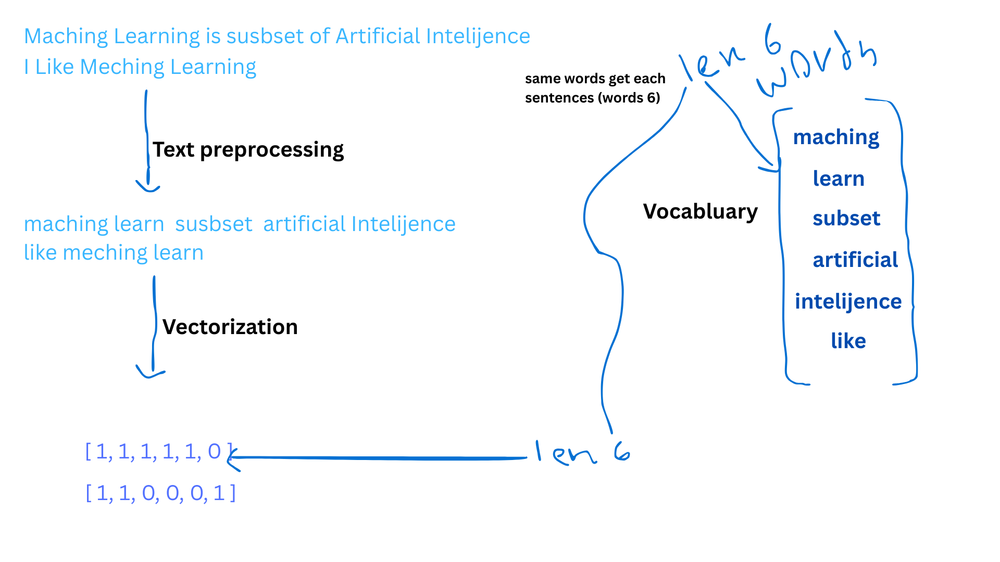

# 📘 Sentiment Analysis Project

This project converts text sentences into numerical vectors using the **Bag of Words (BoW)** technique and trains a machine learning model to predict sentiment.

---

## 📌 1. Project Workflow

Raw Text Data
↓
Text Preprocessing
↓
Build Vocabulary
↓
Convert Sentences → Numerical Vectors
↓
Train Machine Learning Model
↓
Predict Sentiment for New Sentences

---

## 📌 2. Vocabulary → Word Count Vector Explanation

All sentences are read and preprocessed.  
Then the system collects **unique words** (vocabulary).  
Each sentence is converted into a numerical list based on how many times each vocabulary word appears.

Example numerical vector:
[1, 0, 1, 0, 1, 1]
 

This means:

- Word1 → appears 1 time  
- Word2 → appears 0 times  
- Word3 → appears 1 time  
- …  

📌 Diagram

---

## 📌 2. Preprocessing Steps

Before converting sentences into numbers, each sentence is cleaned:

- Convert to lowercase  
- Remove punctuation  
- Remove numbers  
- Remove stopwords  
- Tokenize into words  
- Remove unwanted characters  

**Example**
Raw: "This movie is SUPER good!!!"
Clean: ["this", "movie", "super", "good"]

---

## 📌 3. Vocabulary Creation

The system scans all cleaned sentences and extracts **unique words**.

Example sentences:

"I love this movie"
"This movie is bad"

Vocabulary becomes:
["I", "love", "this", "movie", "is", "bad"]

Each word is assigned an index.

---

## 📌 4. Convert Sentences to Numerical Vectors (Bag of Words)

Every sentence is converted into a numeric list based on the vocabulary.

**Example vocabulary:**

["love", "movie", "bad", "good", "this"]

**Example sentence:**
"I love this movie"

**Vector:**
[1, 1, 0, 0, 1]

Meaning:

- love → 1  
- movie → 1  
- bad → 0  
- good → 0  
- this → 1  

This vector is used as machine-learning input.

---

## 📌 5. Why This Is Important

Machine learning models cannot understand text directly —  
so this conversion process transforms sentences into numbers that the model can learn from.

---

## ✔ Done

This README explains the full process:  
Preprocessing → Vocabulary → Word Count → Numerical Vector → Model Training.

